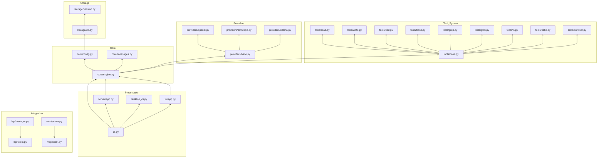

# OpenCode 复刻对比分析报告

## 分析日期
2026-06-14

## 分析工具
- GitDiagram: https://gitdiagram.com/jjjj532/CScode
- Pyreverse: 43 模块，77 导入
- pydeps: 依赖图生成

---

## CScode 现有架构 (Mermaid)

---

## CScode 模块清单

| 模块 | 文件数 | 功能 |
|------|--------|------|
| cli | 1 | 命令行入口 |
| core | 3 | 引擎、配置、消息 |
| tools | 9 | 工具系统 |
| providers | 4 | LLM 提供商 |
| storage | 2 | SQLite 持久化 |
| server | 1 | FastAPI Web 服务 |
| tui | 1 | Textual 终端 UI |
| lsp | 2 | LSP 客户端 |
| mcp | 2 | MCP 协议 |
| plugins | 1 | 插件系统 |
| skills | 1 | 技能系统 |

---

## OpenCode.ai 功能对比

| 功能 | OpenCode.ai | CScode 现状 | 差距 |
|------|-------------|-------------|------|
| LSP 自动加载 | ✅ | ⚠️ 部分 | 需增强自动检测 |
| 多会话并行 | ✅ | ❌ | 需实现 |
| 链接分享 | ✅ | ❌ | 需实现 |
| GitHub Copilot 登录 | ✅ | ❌ | 需实现 OAuth |
| ChatGPT Plus/Pro 登录 | ✅ | ❌ | 需实现 OAuth |
| 75+ LLM 提供商 | ✅ | ⚠️ 3种 | 需扩展 |
| 桌面应用 (Tauri) | ✅ Beta | ⚠️ 初步 | 需完善 |
| Zen 优化模型 | ✅ | ❌ | 需实现 |
| 隐私优先设计 | ✅ | ⚠️ 待强化 | 需审计 |

---

## 核心差距分析

### 1. 多会话并行 (优先级: 高)
**现状**: CScode 单会话模式
**需求**:
- 支持多个并行 Agent 会话
- 会话间隔离与通信
- 会话状态管理

### 2. 链接分享功能 (优先级: 高)
**现状**: 无
**需求**:
- 会话序列化与反序列化
- 唯一链接生成
- 公开/私密分享

### 3. OAuth 第三方登录 (优先级: 中)
**现状**: 仅 API Key 认证
**需求**:
- GitHub OAuth 集成
- OpenAI Account 集成
- Token 刷新与存储

### 4. LLM 提供商扩展 (优先级: 中)
**现状**: OpenAI, Anthropic, Ollama
**需求**:
- Google Gemini
- Azure OpenAI
- Anthropic (已支持)
- 本地模型增强

### 5. Zen 优化模型 (优先级: 低)
**现状**: 无
**需求**:
- 模型性能基准测试
- 推荐系统
- 模型自动选择

---

## 下一步行动建议

1. **阶段 1**: 实现多会话并行支持
2. **阶段 2**: 实现链接分享功能
3. **阶段 3**: 扩展 LLM 提供商
4. **阶段 4**: OAuth 集成
5. **阶段 5**: Zen 模型推荐

---

## 生成的图表

- `/tmp/cscode-deps.png` - 模块依赖图
- `/Users/mac/AI/CScode/classes_cscode.png` - UML 类图
- `/Users/mac/AI/CScode/packages_cscode.png` - UML 包图
